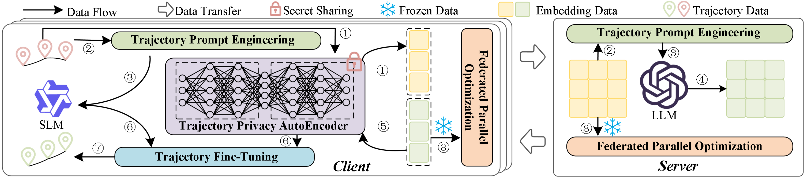

# FedTDP

In this paper, we address the federated trajectory data preparation (F-TDP) problem and present a unified and efficient framework, termed FedTDP. First, we design Trajectory Privacy AutoEncoder (TPA) to safeguard trajectory data privacy while preserving their spatio-temporal correlations. Second, we propose Trajectory Prompt Engineering (TPE) to facilitate the development of TDP-oriented LLMs. Third, we present Trajectory Fine-Tuning (TFT) to reduce training parameters and enhance the learning capabilities of models. Finally, we introduce Federated Parallel Optimization (FPO) to improve the training efficiency of the framework.



## Environment

Python.version = 3.9.19<br>
Other dependencies are listed in requirements.txt.


All the experiments are conducted in the federated environment on nine nodes, one as a server and the other four as
clients, each equipped with two Intel(R) Xeon(R) CPU E5-2650 v4@2.20GHz 12-core processors, 128GB of RAM, and an
internet speed of 100MB/s.

## Datasets

The datasets used in this paper are public and available in https://drive.google.com/drive/folders/1Uo726IFTrFg7f0hXuiY16eg_mGV5BO56?usp=drive_link.

## Model Bases

The model bases (i.e., SLM and LLM) in our framework used in this paper are public and available in https://huggingface.co/zengzhihao/FedTDP

## Baselines

The baselines used in this paper are public and available in https://drive.google.com/drive/folders/1Uo726IFTrFg7f0hXuiY16eg_mGV5BO56?usp=drive_link.

The details of them are also public as follows.

- ATROM: https://github.com/ypeggy/ATROM
- Kamel: https://github.com/meshalawy/KAMEL
- GraphMM: https://github.com/GraphMMmaster/GraphMM-Master
- AttnTUL: https://github.com/Onedean/AttnTUL
- Estimator: https://github.com/ZJU-DAILY/Estimator
- S3: https://github.com/ZJU-DAILY/S3
- LightTR: https://github.com/uestc-liuzq/LightTR
- PromptGAT: https://github.com/DaRL-LibSignal/PromptGAT
- UniST: https://github.com/tsinghua-fib-lab/UniST
- UrbanGPT: https://github.com/HKUDS/UrbanGPT
- FM4DP: https://github.com/HazyResearch/fm_data_tasks
- MELD: https://github.com/authurlord/MELD
- TableGPT: https://github.com/microsoft/Table-GPT

## Complication

The running example of FedTDP is as follows.
````
deepspeed --num_gpus=2 main.py --task trajectory imputation --dataset geolife --data 'data_path' --slm gpt3-small --llm llama --address 'your_address' --deepspeed_config ds_config.json
